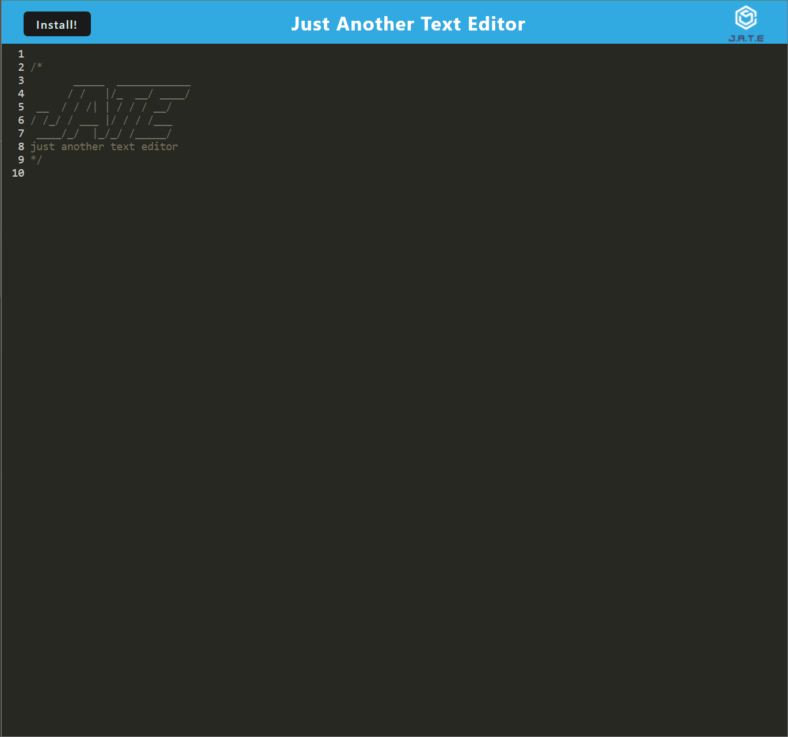

# Tech Blog

## Table of Contents
1. [Description](#description)
2. [Installation](#installation)
3. [Usage](#usage)
4. [Contributing](#contributing)
5. [Tests](#tests)
6. [License](#license)
7. [Questions](#questions)
8. [Media](#media)

## Description
This application is an installable PWA with the ability to work offline. 

## Installation
To install the application, follow the [LINK](https://uwtexteditor.herokuapp.com/) to the deployed website and select the "Install" button in the upper left hand corner.

## Usage
Write code in a simple text editor from anywhere in your web browser.

## Contributing
This application is open source, anyone may use or contribute to the application.

## Tests
No test suites have been run at this time.

## License
This application is currently covered under the MIT License. More information about this license can be viewed under the file named 'LICENSE' in the repository.

## Questions
If you have any questions, feel free to reach out to me at my email: djohncaldwell@gmail.com

All of my work can be viewed at my GitHub profile: [CaldwellDerek](https://github.com/CaldwellDerek)

## Media

Home Page
